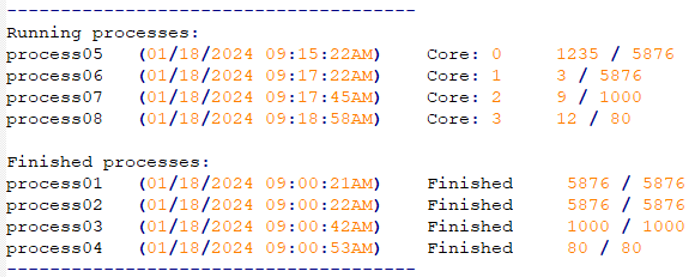
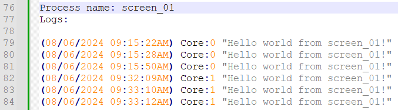

Week 6 - Group Homework - FCFS scheduler in OS emulator
Due: Sat Jun 20, 2026 11:00pmDue: Sat Jun 20, 2026 11:00pm
Ungraded, 40 Possible Points
40 Points Possible
Attempt
Attempt 1

In Progress
NEXT UP: Submit Assignment

2 Attempts Allowed
Available: Jun 1, 2026 7:00am until Jun 20, 2026 11:00pmAvailable: Jun 1, 2026 7:00am until Jun 20, 2026 11:00pm
Implementing the first-come-first-serve scheduler in your emulator

 

Instructions:

This is part of your group output, which is your OS emulator.
Using the reference UI layout above, implement a first-come-first-serve (FCFS) scheduler, emphasizing the multi-threaded approach discussed in your lecture (e.g., 1 thread for the scheduler, 1 thread per CPU worker)
Implement the "print" command with the following behavior: each process creates a text file where all its associated print commands are written, with the timestamp of when it was executed by the CPU and the CPU core that executed it. Format example:

Thus, if there are 10 processes, 10 text files should be created.
Declare 4 cores for the CPU scheduler.
Record the following test case:
Create 10 processes, each with 100 print commands, upon the start of your OS emulator.
Periodically type the "screen -ls" command every 1 - 2 seconds until all processes are shown in the "finished processes" list.
Type "exit" to close your emulator.
Submit your text files generated by your processes, as a ZIP file.
EXPECTED RESULT: Your emulator should finish all processes in a first-come-first-serve sequence and produce 10 text files containing its associated print statements.

IMPORTANT NOTE: The "print command described in #3 is temporary and will only be used for this homework's grading. Please disable the creation of text files for your machine project submission as this will have a direct impact on the performance of your scheduler.

 

Guidelines:

Your video must be seamless and not cut. The minimum video quality should be at least 480p and a maximum of 720p. Please ensure that the font size of your IDE is large enough to be readable on video.
Maximum video size should be limited to 1GB. 
You are not allowed to access/modify your code while performing the test case. 
The video should always show you pressing Run/Debug from your IDE, which should initialize your program. Once running, you are not allowed to exit from your program and attempt to modify your code.
Not following upload instructions will invalidate your submission.
 

Week 6 - June 11 - Homework Rubric
Week 6 - June 11 - Homework Rubric
Criteria	Ratings	Points
CPU scheduler

Full Marks
- Should show all processes move from running to finished state without intervention from the user.
20 pts

Minor Issues
12 pts

Major Issues
8 pts

No Marks
0 pts
/20 pts
Screen -ls UI format

Full Marks
Consistent with reference photo
10 pts

Minor Issues
6 pts

Major Issues
4 pts

No Marks
0 pts
/10 pts
Print command correctness

Full Marks
- Correctly writes messages in the text files
- Shows timestamp + CPU of where it was executed.
10 pts

Minor Issues
6 pts

Major Issues
4 pts

No Marks
0 pts
/10 pts
